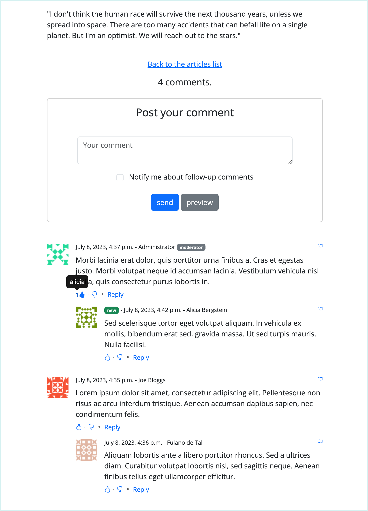

.. django-comments-xtd documentation master file, created by
   sphinx-quickstart on Mon Dec 19 19:20:12 2011.
   You can adapt this file completely to your liking, but it should at least
   contain the root `toctree` directive.

==============================
Welcome to django-comments-xtd
==============================

.. module:: django_comments_xtd
   :synopsis: django-comments-extended.

.. highlightlang:: html+django

A Django pluggable application that adds comments to your project. It extends
the once official `Django Comments Framework
<https://pypi.python.org/pypi/django-contrib-comments>`_.

.. note::

    This documentation represents the current version, v2.8.2, of
    django-comments-xtd. For old versions of the documentation:

    * v2.7.2: https://django-comments-xtd.readthedocs.io/en/2.7.2/
    * v2.6.2: https://django-comments-xtd.readthedocs.io/en/2.6.2/
    * v2.5.1: https://django-comments-xtd.readthedocs.io/en/2.5.1/
    * v2.4.3: https://django-comments-xtd.readthedocs.io/en/2.4.3/
    * v2.3.1: https://django-comments-xtd.readthedocs.io/en/2.3.1/
    * v2.2.1: https://django-comments-xtd.readthedocs.io/en/2.2.1/
    * v2.1.0: https://django-comments-xtd.readthedocs.io/en/2.1.0/
    * v2.0.10: https://django-comments-xtd.readthedocs.io/en/2.0.10/
    * v1.7.1: https://django-comments-xtd.readthedocs.io/en/1.7.1/
    * v1.6.7: https://django-comments-xtd.readthedocs.io/en/1.6.7/
    * v1.5.1: https://django-comments-xtd.readthedocs.io/en/1.5.1/

Features
========

.. index::
   single: Features

#. Thread support, so comments can be nested.
#. Customizable maximum thread level, either for all models or on a per
   app.model basis.
#. Optional notifications on follow-up comments via email.
#. Mute links to allow cancellation of follow-up notifications.
#. Comment confirmation via email when users are not authenticated.
#. Comments hit the database only after they have been confirmed.
#. Registered users can like/dislike comments and can suggest comments removal.
#. Template tags to list/render the last N comments posted to any given list of
   app.model pairs.
#. Emails sent through threads (can be disable to allow other solutions, like a
   Celery app).
#. Fully functional JavaScript plugin using ReactJS, jQuery, Bootstrap,
   Remarkable and MD5.

Getting started
===============

Start with these documents to get you up and running:

.. toctree::
   :maxdepth: 2

   quickstart
   tutorial
   example

Advanced Use
============

Once you've got django-comments-xtd working, you may want to know more about
specific features, or check out the use cases to see how others customize it.

.. toctree::
   :maxdepth: 1

   logic
   webapi
   javascript
   templatetags
   migrating
   extending
   i18n
   settings
   templates
   usecases

Change Log
==========

[2.8.3] -
--------------------

    * Adds new setting COMMENTS_XTD_DEFAULT_FOLLOWUP, which is used to initialise the follow-up form field. By default its value is False. Thanks to @drholera. Closes ticket `#206 <https://github.com/danirus/django-comments-xtd/issues/206>`_.

[2.8.2] - 2021-01-24
--------------------

    * Fixes issue `#248 <https://github.com/danirus/django-comments-xtd/issues/248>`_, about the API returning comments' submit_date in UTC when the setting USE_TZ is enabled and a different TIME_ZONE is given. Thanks to @Loneattic.
    * Fixes issue `#250 <https://github.com/danirus/django-comments-xtd/issues/250>`_, which reports that using the web API to post a comment with a reply_to field that would break the max_thread_level should not produce an exception but rather a controlled response with an appropriate HTTP code.  Thanks to @impythonista.
    * Fixes issue `#255 <https://github.com/danirus/django-comments-xtd/issues/255>`_, about the web API not returning the comment ID when creating a new comment. Thanks to @mhoonjeon.
    * Fixes issue `#256 <https://github.com/danirus/django-comments-xtd/issues/256>`_, about an issue in the JavaScript plugin that displays the "reply" link even when the max_thread_level has been reached. Thanks to @odescopi.

[2.8.1] - 2020-10-16
--------------------

    * Fixes issue `#80 <https://github.com/danirus/django-comments-xtd/issues/80>`_, that requests to change the response when clicking more than once on a comment confirmation link. Up until now clicking more than once on a comment confirmation link produced a HTTP 404 response. Since version 2.8.1 the response is the same as for the first click: the user is redirected to the comment's view in the page. Thanks to @ppershing.
    * Fixes issue `#152 <https://github.com/danirus/django-comments-xtd/issues/152>`_, about loading the `staticfiles` templatetag instead of `static`. Since Django v3.0 the staticfiles app requires using the latter. Thanks to @JonLevy and @mennucc.
    * Fixes issue `#221 <https://github.com/danirus/django-comments-xtd/issues/221>`_, about the get_version function. Now it returns the full
      version number ``<major>.<minor>.<patch>``. Thanks to @mckinly.
    * Fixes issue `#229  <https://github.com/danirus/django-comments-xtd/issues/229>`_, about failing to process empty honeypot field when posting comments using the REST API. Thanks to @TommasoAmici.

[2.8.0] - 2020-09-26
--------------------

    * Fixes issue `#106 <https://github.com/danirus/django-comments-xtd/issues/106>`_, which is about computing the number of nested comments for every comment at every level down the tree. The fix consists of adding a new field called ``nested_count`` to the **XtdComment** model. Its value represents the number of threaded comments under itself. A new management command, ``initialize_nested_count``, can be used to update the value of the field, the command is idempotent. Two new migrations have been added: migration 0007 adds the new field, and migration 0008 calls the ``initialize_nested_count`` command to populate the ``nested_count`` new field with correct values.
    * Fixes issue `#215 <https://github.com/danirus/django-comments-xtd/issues/205>`_ about running the tests with Django 3.1 and Python 3.8.

[2.7.2] - 2020-09-08
--------------------

    * Fixes issue `#208 <https://github.com/danirus/django-comments-xtd/issues/208>`_, about the JavaScript plugin not displaying the like and dislike buttons and the reply link when django-comments-xtd is setup to allow posting comments only to registered users (``who_can_post: "users"``).
    * Fixes issue `#212 <https://github.com/danirus/django-comments-xtd/issues/212>`_, about missing i18n JavaScript catalog files for Dutch, German and Russian.

[2.7.1] - 2020-08-12
--------------------

    * Fixes issue `#188 <https://github.com/danirus/django-comments-xtd/issues/188>`_, about loading a templatetags module not required for the application.
    * Fixes issue `#196 <https://github.com/danirus/django-comments-xtd/issues/196>`_. When extending django-comments-xtd's comment model, the receiver function that reviews whether nested comments have to be publish or unpublish is not called.

[2.7.0] - 2020-08-09
--------------------

    * Enhancement, closing issue `#155 <https://github.com/danirus/django-comments-xtd/issues/155>`_ (and `#170 <https://github.com/danirus/django-comments-xtd/issues/170>`_), on how to post comments via the web API. Up until version 2.6.2 posting comments required the fields timestamp, security_hash and honeypot. As of 2.7.0 there is support allow Django REST Framework authentication classes: ``WriteCommentSerializer`` send the signal ``should_request_be_authorize`` that enables posting comments. Read the documentation about the web API.
    * Enhancement, closing issue `#175 <https://github.com/danirus/django-comments-xtd/issues/175>`_ on how to customize django-comments-xtd so that user images displayed in comments come from other sources. A new setting ``COMMENTS_XTD_API_GET_USER_AVATAR`` has been added. The docs have been extended with a page that explains the use case in depth.
    * Fixes issue `#171 <https://github.com/danirus/django-comments-xtd/issues/171>`_, on wrong permission used to decide whether a user is a moderator. The right permission is ``django_comments.can_moderate``. (thanks to Ashwani Gupta, @ashwani99).
    * Fixes issue `#136 <https://github.com/danirus/django-comments-xtd/issues/136>`_ on missing <link> element in the ``templates/base.html`` file distributed with the **tutorial.tar.gz** bundle.

[2.6.2] - 2020-07-05
--------------------

    * Adds Dutch translation (thanks to Jean-Paul Ladage, @jladage).
    * Adds Russian translation (thanks to Михаил Рыбкин, @MikerStudio).
    * Fixesissue `#140 <https://github.com/danirus/django-comments-xtd/issues/140>`_, which adds the capacity to allow only registered users to post comments.
    * Fixesissue `#149 <https://github.com/danirus/django-comments-xtd/issues/149>`_, on wrong SQL boolean literal value used when running special command ``populate_xtdcomments`` to load Postgres database with xtdcomments.
    * Fixes issue `#154 <https://github.com/danirus/django-comments-xtd/issues/154>`_, on using string formatting compatible with Python versions prior to 3.6.
    * Fixes issue `#156 <https://github.com/danirus/django-comments-xtd/issues/156>`_, on wrong props name ``poll_interval``. JavaScript plugin expects the use of ``polling_interval`` while the ``api/frontend.py`` module referred to it as ``poll_interval``. (thanks to @ashwani99).
    * Fixes issue `#159 <https://github.com/danirus/django-comments-xtd/issues/159>`_, about using the same id for all the checkboxes in the comment list. When ticking one checkbox in a nested form the checkbox of the main form was ticked. Now each checkbox has a different id, suffixed with the content of the ``reply_to`` field.

[2.6.1] - 2020-05-13
--------------------

    * Fixes issue `#150 <https://github.com/danirus/django-comments-xtd/issues/150>`_, about wrong protocol in the URL when fetching avatar images from gravatar.

[2.6.0] - 2020-05-12
--------------------

    * Fixes issue `#145 <https://github.com/danirus/django-comments-xtd/issues/145>`_, on inadequate number of SQL queries used by API entry point **comments-xtd-api-list**, available in the URL ``/comments/api/<content-type>/<object-pk>/``. The issue also happened when rendering the comments using tags ``get_xtdcomment_tree`` and ``render_xtdcomment_tree``. It has been fixed in both cases too.
    * Updates the JSON schema of the output retrieved by the API entry point **comments-xtd-api-list**. Thus the version number change. The flags attribute of each retrieved is now a list of flags instead of a summary for each the flags: "I like it", "I dislike it", "suggest removal".

[2.5.1] - 2020-04-27
--------------------

    * Fixes issue `#138 <https://github.com/danirus/django-comments-xtd/issues/138>`_, on unpublishing a single comment with public nested comments. The fix consists of a new ``pre_save`` receiver that will either publish or unpublish nested comments when a comment changes its ``is_public`` attribute. (thanks to @hematinik).

[2.5.0] - 2020-04-22
--------------------

    * Fixes issue `#144 <https://github.com/danirus/django-comments-xtd/issues/144>`_ regarding the size of the JavaScript bundle. The new JavaScript plugin does not include React and ReactDOM. The two libraries have to be loaded with an external script.
    * Update the dependencies of the JavaScript plugin.

[2.4.3] - 2020-01-26
--------------------

    * Fixes issue on the ContentType that happens when sending post request with empty data. (PR: `#137 <https://github.com/danirus/django-comments-xtd/pull/137>`_) (thanks to @dvorberg).
    * Adds German translations, (thanks to @dvorberg).

[2.4.2] - 2019-12-25
--------------------

    * Adds Django 3.0 compatibility thanks to Sergey Ivanychev (@ivanychev).
    * Adds Norwegian translations thanks to Yngve Høiseth (@yhoiseth).

[2.4.1] - 2019-09-30
--------------------

    * Allow changing the ``d`` parameter when requesting a gravatar, thanks to @pylixm (PR: `#100 <https://github.com/danirus/django-comments-xtd/pull/100>`_).
    * Avoid requiring the ``SITE_ID``, thanks to @gassan (PR: `#125 <https://github.com/danirus/django-comments-xtd/pull/125>`_).

[2.4.0] - 2019-02-19
--------------------

    New minor release thanks to Mandeep Gill with the following changes:

    * Adds support for non-int based ``object_pk``, for instead when using UUIDs or HashIds as the primary key on a model (closes `#112 <https://github.com/danirus/django-comments-xtd/issues/112>`_).
    * Refactors the commentbox props generation into a separate function so can be used from the webapi for use with rest-framework/API-only backends that don't make use of server-side templates.
    * Adds a **pyproject.yaml** for use with `poetry <https://poetry.eustace.io>`_ and new pip environments (PEP 518).

[2.3.1] - 2019-01-08
--------------------

    * Fixes issue `#116 <https://github.com/danirus/django-comments-xtd/issues/116>`_.
    * Updates package.json JavaScript dependencies:
     * babel-cli from 6.24.1 to 6.26.0.
     * jquery from 3.2.1 to 3.3.1.

[2.3.0] - 2018-11-29
--------------------

    * Upgrades Twitter-Bootstrap from v3 to v4.
    * Fixes issue with tutorial fixtures (bug `#114 <https://github.com/danirus/django-comments-xtd/issues/114>`_).
    * Upgrade all JavaScript dependencies. Check packages.json for details. The major changes are:
     * ReactJS updates from 15.5 to 16.5.
     * Babel updates from 6 to 7.
     * Webpack from 2.4.1 to 4.21.0.
     * Bootstrap from 3.3.7 to 4.1.3.
    * Updates webpack.config.js.
    * Demo sites and tutorial have been adapted to Twitter Bootstrap v4.
    * Fixes issues `#94 <https://github.com/danirus/django-comments-xtd/issues/94>`_, `#108 <https://github.com/danirus/django-comments-xtd/issues/108>`_, `#111 <https://github.com/danirus/django-comments-xtd/issues/111>`_.

[2.2.1] - 2018-10-06
--------------------

    * Resolves deprecation warnings and adopt recommendations in unit tests.
    * Fixes demo sites so that they work with Django 1.11, Django 2.0 and Django 2.1.

[2.2.0] - 2018-08-12
--------------------

    * Adds support for Django 2.1.
    * Drops support for Django < 1.11 as it depends on django-contrib-comments which dropped support too.
    * Fixes issue `#104 <https://github.com/danirus/django-comments-xtd/issues/104>`_ (on lack of Django 2.1 support).

[2.1.0] - 2018-02-13
--------------------

    * Fixes issues `#76 <https://github.com/danirus/django-comments-xtd/issues/76>`_, `#86 <https://github.com/danirus/django-comments-xtd/issues/86>`_ and `#87 <https://github.com/danirus/django-comments-xtd/issues/87>`_.
    * Request user name and/or email address in case the user is logged in but the user's email attribute is empty and/or the user's ``get_full_name()`` method returns an empty string.

[2.0.10] - 2018-01-19
---------------------

	* Adds Django 2.0 compatibility.
	* Fixes issues `#81 <https://github.com/danirus/django-comments-xtd/issues/81>`_ and `#83 <https://github.com/danirus/django-comments-xtd/issues/83>`_.
	* Replaces the use of ``django.test.client`` by ``RequestFactory`` in unittests.

[2.0.9] - 2017-11-09
--------------------

	* Fix issue `#77 <https://github.com/danirus/django-comments-xtd/issues/77>`_. Template filter ``xtd_comment_gravatar_url`` must not hard-code http schema in URL (reported by @pamost).

[2.0.8] - 2017-09-24
--------------------

	* App translation to Finnish, thanks to Tero Tikkanen (@terotic).

[2.0.7] - 2017-09-20
--------------------

	* Adds missing migration for a field's label (issue `#71 <https://github.com/danirus/django-comments-xtd/issues/71>`_).
	* Makes the form label for field ``name`` translatable (issue `#73 <https://github.com/danirus/django-comments-xtd/issues/73>`_).

[2.0.6] - 2017-08-08
--------------------

	* Code fixes to enable proper support for the Django Sites Framework.
	* Code fixes for the comp demo site.
	* Makes demo site dates in initial data files timezone aware.
	* Improves documentation on setting up demo sites.
	* Style changes in CSS wells.

[2.0.5] - 2017-07-20
--------------------

	* Surpass version number to fix problem with package upload in PyPI.
	* No changes applied to this version.

[2.0.4] - 2017-07-19
--------------------

	* Use ``django.core.signing`` with temporary comment passed in URL redirection.
	* Fix mistakes in documentation.

[2.0.3] - 2017-07-10
--------------------

	* App translation to French thanks to Brice Gelineau.
	* Fixed **MANIFEST.in** file, so that files with translations are distributed.

[2.0.0] - 2017-06-04
--------------------

	* Javascript plugin (based on ReactJS).
	* Web API to:
	  * Create a comment for a given content type and object ID.
	  * List comments for a given content type and object ID.
	  * Send feedback flags (like/dislike) on comments.
	  * Send report flag (removal suggestion) for a comment.
	  * Template filter ``has_permission`` applicable to a user object and accepting a string specifying the ``app_label.permission`` being checked. It returns ``True`` if the user has the given permission, otherwise returns ``False``.
	* Setting ``COMMENTS_XTD_API_USER_REPR`` defines a lambda function to return the user string representation used by the web API in response objects.
	* Setting ``COMMENTS_XTD_APP_MODEL_PERMISSIONS`` to explicitly define what commenting features are enabled on per app.model basis.
	* Templates ``comments/delete.html`` and ``comments/deleted.html`` matching django-comments-xtd default twitter-bootstrap styling.
	* Dependencies on Python packages: djangorestframework.
	* Supports i18n for English and Spanish.
	* All settings namespaced inside the COMMENTS_XTD setting.
	* Management command to migrate comments from django-contrib-comments to django-comments-xtd.
	* Enable removal link in ``django_comments_xtd/comment_tree.html`` when the user has the permission ``django_comments.can_moderate``.
	* Changed, when the user logged has ``django_comments.can_moderate`` permission, template ``django_comments_xtd/comment_tree.html`` will show the number of removal suggestions a comment has received.
	* Changed, when a comment is marked as removed by a moderator (using django-comments' **comments-delete** url) every nested comment below the one removed is unpublished (``is_public`` attribute is turned to ``False``).
	* Changed view helper functions, ``perform_like+` and ``perform_dislike`` now returns a boolean indicating whether a flag was created. If ``True`` the flag has been created. If ``False`` the flag has been deleted. These two functions behave as toggle functions.
	* Changed templates ``comments/preview.html``, ``comments/flag.html`` and ``comments/flagged.hml``.
	* Removed dependency on django-markup.
	* Removed template filter ``render_markup_comment``.
	* Removed setting ``MARKUP_FALLBACK_FILTER``.
