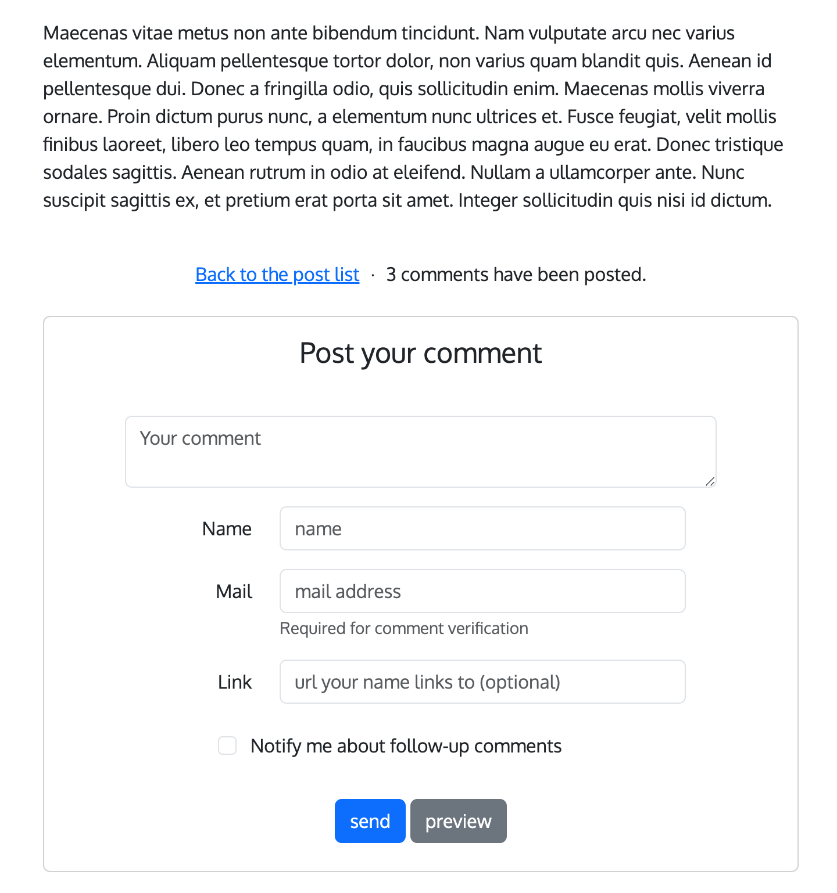
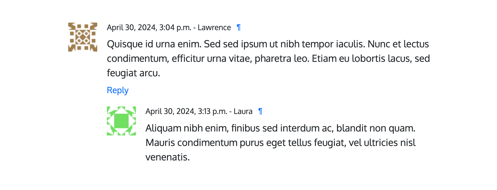
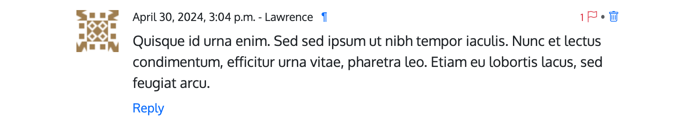
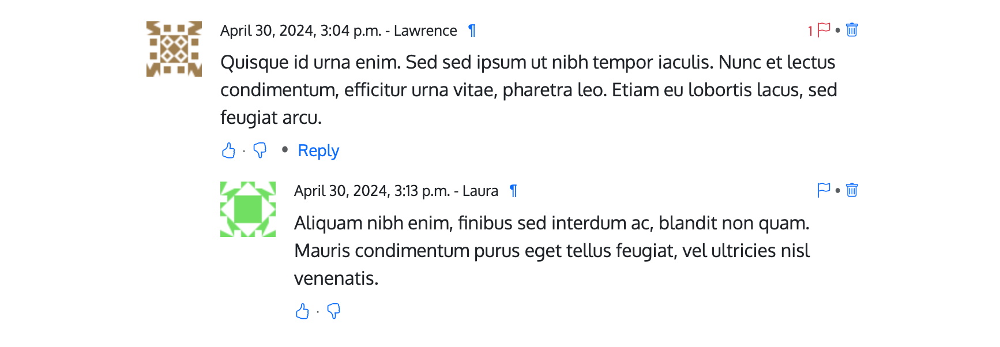
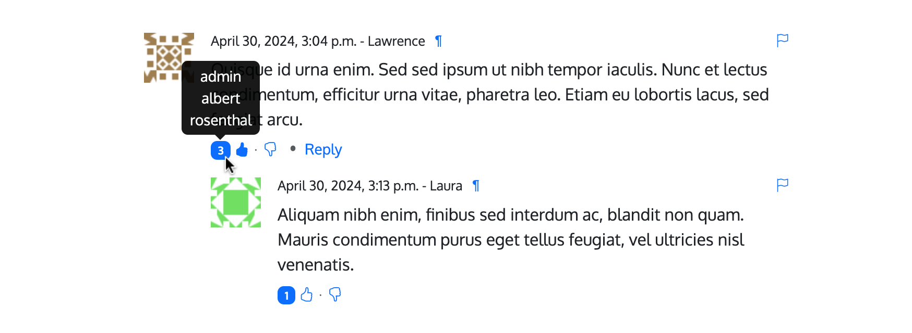
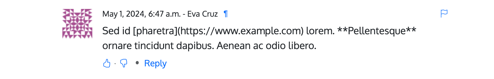
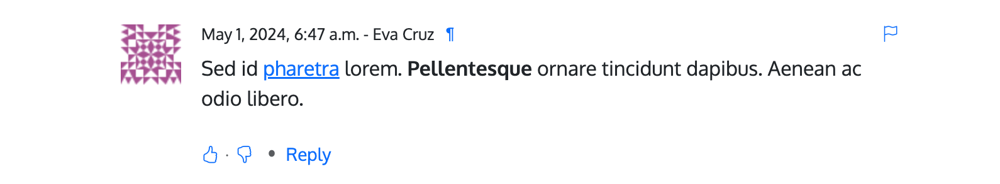
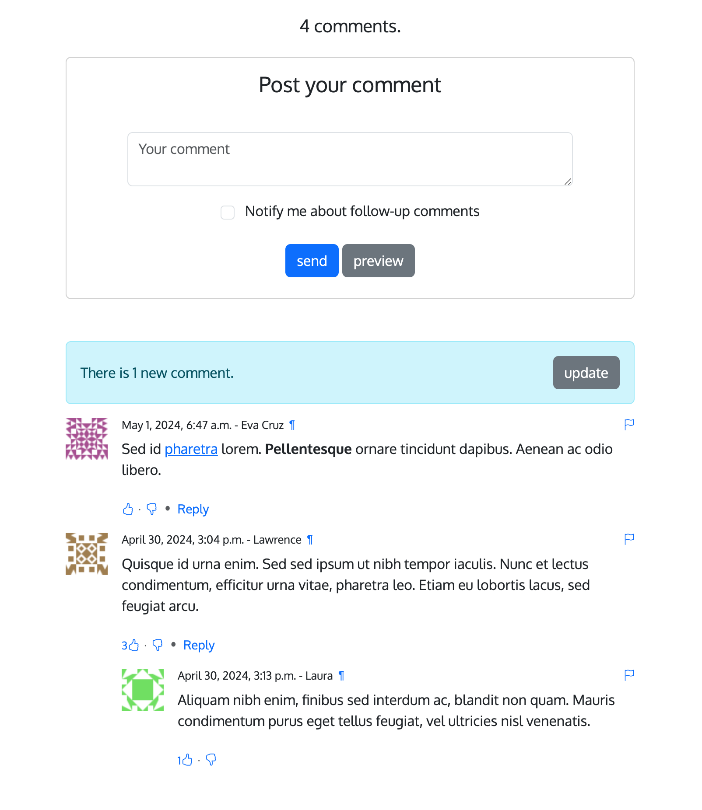

.. _ref-tutorial:

========
Tutorial
========

This tutorial guides you through the steps to use every feature of
django-comments-xtd together with the `Django Comments Framework
<https://github.com/django/django-contrib-comments>`_. The Django project
used throughout the tutorial is available to `download
<https://github.com/danirus/django-comments-xtd
/raw/master/example/tutorial.tar.gz>`_. Following the tutorial will take
about an hour, and it is highly recommended to get a comprehensive
understanding of django-comments-xtd.

.. contents:: Table of Contents
   :depth: 3
   :local:

.. index::
   single: Introduction

Introduction
============

Through the following sections the tutorial will cover the creation of a
simple blog with stories to which we will add comments, exercising each and
every feature provided by both, django-comments and django-comments-xtd,
from comment post verification by mail to comment moderation and nested
comments.

.. index::
   single: preparation
   pair: tutorial; preparation

Preparation
===========

Before we install any package we will set up a virtualenv and install
everything we need in it.

   .. code-block:: bash

       $ mkdir ~/django-comments-xtd-tutorial
       $ cd ~/django-comments-xtd-tutorial
       $ virtualenv venv
       $ source venv/bin/activate
       (venv)$ pip install django-comments-xtd
       (venv)$ wget https://github.com/danirus/django-comments-xtd/raw/master/example/tutorial.tar.gz
       (venv)$ tar -xvzf tutorial.tar.gz
       (venv)$ cd tutorial

By installing django-comments-xtd we install all its dependencies, Django and
django-contrib-comments among them. So we are ready to work on the project.
Take a look at the content of the tutorial directory, it contains:

 * A **blog** app with a **Post** model. It uses two generic class-based views
   to list the posts and show a post in detail.
 * The **templates** directory, with a **base.html** and **home.html**, and
   the templates for the blog app: **blog/post_list.html** and
   **blog/post_detail.html**.
 * The **static** directory with a **css/bootstrap.min.css** file (this file
   is a static asset available, when the app is installed, under the path
   **django_comments_xtd/css/bootstrap.min.css**).
 * The **tutorial** directory containing the **settings** and **urls** modules.
 * And a **fixtures** directory with data files to create the *admin* superuser
   (with *admin* password), the default site and some blog posts.

Let's finish the initial setup, load the fixtures and run the development
server:

   .. code-block:: bash

       (venv)$ python manage.py migrate
       (venv)$ python manage.py loaddata fixtures/*.json
       (venv)$ python manage.py runserver

Head to http://localhost:8000 and visit the tutorial site.

.. note:: Remember to implement the `get_absolute_url` in the model class whose
          objects you want to receive comments, like the class `Post` in this
          tutorial. It is so because the permanent URL of each comment uses the
          `shortcut` view of `django.contrib.contenttypes` which in turn uses
          the `get_absolute_url` method.

.. _configuration:

Configuration
=============

Now that the project is running we are ready to add comments. Edit the settings
module, ``tutorial/settings.py``, and make the following changes:

   .. code-block:: python

       INSTALLED_APPS = [
           ...
           'django_comments_xtd',
           'django_comments',
           'blog',
       ]
       ...
       COMMENTS_APP = 'django_comments_xtd'

       # Either enable sending mail messages to the console:
       EMAIL_BACKEND = 'django.core.mail.backends.console.EmailBackend'

       # Or set up the EMAIL_* settings so that Django can send emails:
       EMAIL_HOST = "smtp.mail.com"
       EMAIL_PORT = "587"
       EMAIL_HOST_USER = "alias@mail.com"
       EMAIL_HOST_PASSWORD = "yourpassword"
       EMAIL_USE_TLS = True
       DEFAULT_FROM_EMAIL = "Helpdesk <helpdesk@yourdomain>"

Edit the urls module of the project, ``tutorial/tutorial/urls.py`` and mount
the URL patterns of django_comments_xtd in the path ``/comments/``. The urls
installed with django_comments_xtd include django_comments' urls too:

   .. code-block:: python

       from django.urls import include, path

       urlpatterns = [
           ...
           path(r'comments/', include('django_comments_xtd.urls')),
           ...
       ]

Now let Django create the tables for the two new applications:

   .. code-block:: bash

       $ python manage.py migrate

Be sure that the domain field of the ``Site`` instance points to the correct
domain, which for the development server is expected to be  ``localhost:8000``.
The value is used to create comment verifications, follow-up cancellations,
etc. Edit the site instance in the admin interface in case you were using a
different value.

Comment confirmation
--------------------

Before we go any further we need to set up the :setting:`COMMENTS_XTD_SALT`
setting. This setting plays an important role during the comment confirmation
by mail. It helps obfuscating the comment before the user approves its
publication.

It is so because django-comments-xtd does not store comments in the server
until they have been confirmed. This way there is little to none possible
comment spam flooding in the database. Comments are encoded in URLs and sent
for confirmation by mail. Only when the user clicks the confirmation URL the
comment lands in the database.

This behaviour is disabled for authenticated users, and can be disabled for
anonymous users too by simply setting :setting:`COMMENTS_XTD_CONFIRM_EMAIL` to
``False``.

Now let's append the following entries to the tutorial settings module:

   .. code-block:: python

       #  To help obfuscating comments before they are sent for confirmation.
       COMMENTS_XTD_SALT = (b"Timendi causa est nescire. "
                            b"Aequam memento rebus in arduis servare mentem.")

       # Source mail address used for notifications.
       COMMENTS_XTD_FROM_EMAIL = "noreply@example.com"

       # Contact mail address to show in messages.
       COMMENTS_XTD_CONTACT_EMAIL = "helpdesk@example.com"

Comments tags
=============

Next step consist of editing ``blog/post_detail.html`` and loading the
``comments`` templatetag module after the ``extends`` tag:

   .. code-block:: html+django

       
       

Now we will change the blog post detail template to:

 #. Show the number of comments posted to the blog story,
 #. List the comments already posted, and
 #. Show the comment form, so that comments can be sent.

By using the :ttag:`get_comment_count` tag we will show the number of comments
posted. Change the code around the link element to make it look as follows:

   .. code-block:: html+django

       
       

         <a href="">Back to the post list</a>
         &nbsp;&sdot;&nbsp;
         {{ comment_count }} comment{{ comment_count|pluralize }}
         ha{{ comment_count|pluralize:"s,ve" }} been posted.
       

Now let's add the code to list the comments posted to the story. We can make
use of two template tags, :ttag:`render_comment_list` and
:ttag:`get_comment_list`. The former renders a template with the comments
while the latter put the comment list in a variable in the context of the
template.

When using the first, :ttag:`render_comment_list`, with a ``blog.post`` object,
Django will look for the template ``list.html`` in the following directories:

   .. code-block:: shell

       comments/blog/post/list.html
       comments/blog/list.html
       comments/list.html

Both, django-contrib-comments and django-comments-xtd, provide the last template
of the list, ``comments/list.html``. The one provided within
django-comments-xtd comes with styling based on twitter-bootstrap_.

Django will use the first template found depending on the order in which
applications are listed in :setting:`INSTALLED_APPS`. In this tutorial
django-comments-xtd is listed first and therefore its ``comment/list.html``
template will be found first.

Let's modify the ``blog/post_detail.html`` template to make use of the
:ttag:`render_comment_list`. Add the following code at the end of the page,
before the ``endblock`` tag:

   .. code-block:: html+django

       
       

       

         
       

       

Below the list of comments we want to display the comment form. There are two
template tags available for that purpose, the :ttag:`render_comment_form` and
the :ttag:`get_comment_form`. The former renders a template with the comment
form while the latter puts the form in the context of the template giving more
control over the fields.

We will use the first tag, :ttag:`render_comment_form`. Again, add the
following code before the ``endblock`` tag:

   .. code-block:: html+django

       
       

         

           <h4 class="card-title text-center pb-3">Post your comment</h4>
             
         

       

       

.. note:: The ```` and corresponding ```` are not necessary in your code. I use it in this tutorial (and in the demo sites) as a way to disable comments whenever the author of a blog post decides so. It has been mentioned `here <https://github.com/danirus/django-comments-xtd/issues/108>`_ too.

Finally, before completing this first set of changes, we could show the number
of comments along with post titles in the blog's home page. For this we have to
edit ``blog/post_list.html`` and make the following changes:

   .. code-block:: html+django

       
       

       ...
           
           ...
           
           
Published {{ object.publish }}
             
             &sdot;&nbsp;{{ comment_count }} comment{{ comment_count|pluralize }}
             
           

           ...
           

Now we are ready to send comments. If you are logged in in the admin site, your
comments won't need to be confirmed by mail. To test the confirmation URL do
logout of the admin interface. Bear in mind that :setting:`EMAIL_BACKEND` is set
up to send mail messages to the console, so look in the console after you post
the comment and find the first long URL in the message. To confirm the comment
copy the link and paste it in the location bar of the browser.

The setting :setting:`COMMENTS_XTD_MAX_THREAD_LEVEL` is ``0`` by default, which
means comments can not be nested. Later in the threads section we will enable
nested comments. Now we will set up comment moderation.

.. index::
   single: Moderation

.. _moderation:

Moderation
==========

One of the differences between django-comments-xtd and other commenting
applications is the fact that by default it requires comment confirmation by
email when users are not logged in, a very effective feature to discard unwanted
comments. However there might be cases in which you would prefer a different
approach. Django Comments Framework comes with `moderation capabilities
<http://django-contrib-comments.readthedocs.io/en/latest/moderation.html>`_
included upon which you can build your own comment filtering.

Comment moderation is often established to fight spam, but may be used for other
purposes, like triggering actions based on comment content, rejecting comments
based on how old is the subject being commented and whatnot.

In this section we want to set up comment moderation for our blog application,
so that comments sent to a blog post older than a year will be automatically
flagged for moderation. Also we want Django to send an email to registered
:setting:`MANAGERS` of the project when the comment is flagged.

Let's start adding our email address to the :setting:`MANAGERS` in the
``tutorial/settings.py`` module:

   .. code-block:: python

       MANAGERS = (
           ('Joe Bloggs', 'joe.bloggs@example.com'),
       )

Now we will create a new ``Moderator`` class that inherits from Django Comments
Frammework's ``CommentModerator``. This class enables moderation by defining a
number of class attributes. Read more about it in `moderation options
<https://django-contrib-comments.readthedocs.io/en/latest/moderation.html
#moderation-options>`_, in the official documentation of the Django Comments
Framework.

We will also register our ``Moderator`` class with the django-comments-xtd's
``moderator`` object. We use django-comments-xtd's object instead of
django-contrib-comments' because we still want to have confirmation by email
for non-registered users, nested comments, follow-up notifications, etc.

Let's add those changes to the ``blog/model.py`` file:

   .. code-block:: python

       ...
       # Append these imports below the current ones.
       from django_comments.moderation import CommentModerator
       from django_comments_xtd.moderation import moderator

       ...

       # Add this code at the end of the file.
       class PostCommentModerator(CommentModerator):
           email_notification = True
           auto_moderate_field = 'publish'
           moderate_after = 365

       moderator.register(Post, PostCommentModerator)

That makes it, moderation is ready. Visit any of the blog posts with a
``publish`` datetime older than a year and try to send a comment. After
confirming the comment you will see the ``django_comments_xtd/moderated.html``
template, and your comment will be put on hold for approval.

If on the other hand you send a comment to a blog post created within the last
year your comment will not be put in moderation. Give it a try as a logged in
user and as an anonymous user.

When sending a comment as a logged-in user the comment won't have to be
confirmed and will be put in moderation immediately. However, when you send it
as an anonymous user the comment will have to be confirmed by clicking on the
confirmation link, immediately after that the comment will be put on hold
pending for approval.

In both cases, due to the attribute ``email_notification = True`` above, all
mail addresses listed in the :setting:`MANAGERS` setting will receive a
notification about the reception of a new comment. If you did not received
such message, you might need to review your email settings, or the console
output. Read about the mail settings above in the :ref:`configuration` section.
The mail message received is based on the
``comments/comment_notification_email.txt`` template provided with
django-comments-xtd.

A last note on comment moderation: comments pending for moderation have to be
reviewed and eventually approved. Don't forget to visit the comments-xtd app in
the admin_ interface. Filter comments by `is public: No` and `is removed: No`.
Tick the box of those you want to approve, choose **Approve selected comments**
in the **action** dropdown, at the top left of the comment list, and click on
the **Go** button.

.. _disallow:

Disallow black listed domains
-----------------------------

In case you wanted to disable comment confirmation by mail you might want to
set up some sort of control to reject spam.

This section goes through the steps to disable comment confirmation while
enabling a comment filtering solution based on Joe Wein's blacklist_ of
spamming domains. We will also add a moderation function that will put in
moderation comments containing badwords_.

Let us first disable comment confirmation. Edit the ``tutorial/settings.py``
file and add:

   .. code-block:: python

       COMMENTS_XTD_CONFIRM_EMAIL = False

django-comments-xtd comes with a **Moderator** class that inherits from
``CommentModerator`` and implements a method ``allow`` that will do the
filtering for us. We just have to change ``blog/models.py`` and replace
``CommentModerator`` with ``SpamModerator``, as follows:

   .. code-block:: python

       # Remove the CommentModerator imports and leave only this:
       from django_comments_xtd.moderation import moderator, SpamModerator

       # Our class Post PostCommentModerator now inherits from SpamModerator
       class PostCommentModerator(SpamModerator):
           ...

       moderator.register(Post, PostCommentModerator)

Now we can add a domain to the ``BlackListed`` model in the admin_ interface.
Or we could download a blacklist_ from Joe Wein's website and load the table
with actual spamming domains.

Once we have a ``BlackListed`` domain, try to send a new comment and use an
email address with such a domain. Be sure to log out before trying, otherwise
django-comments-xtd will use the logged in user credentials and ignore the
email given in the comment form.

Sending a comment with an email address of the blacklisted domain triggers a
**Comment post not allowed** response, which would have been a HTTP 400 Bad
Request response with ``DEBUG = False`` in production.

Moderate on bad words
---------------------

Let's now create our own Moderator class by subclassing ``SpamModerator``. The
goal is to provide a ``moderate`` method that looks in the content of the
comment and returns ``False`` whenever it finds a bad word in the message. The
effect of returning ``False`` is that comment's ``is_public`` attribute will be
put to ``False`` and therefore the comment will be in moderation.

The blog application comes with a bad word list in the
file ``blog/badwords.py``.

We assume we already have a list of ``BlackListed`` domains and we don't need
further spam control. So we will disable comment confirmation by email. Edit
the ``settings.py`` file:

   .. code-block:: python

       COMMENTS_XTD_CONFIRM_EMAIL = False

Now edit ``blog/models.py`` and add the code corresponding to our new
``PostCommentModerator``:

   .. code-block:: python

       # Below the other imports:
       from django_comments_xtd.moderation import moderator, SpamModerator
       from blog.badwords import badwords

       ...

       class PostCommentModerator(SpamModerator):
           email_notification = True

           def moderate(self, comment, content_object, request):
               # Make a dictionary where the keys are the words of the message
               # and the values are their relative position in the message.
               def clean(word):
                   ret = word
                   if word.startswith('.') or word.startswith(','):
                       ret = word[1:]
                   if word.endswith('.') or word.endswith(','):
                       ret = word[:-1]
                   return ret

               lowcase_comment = comment.comment.lower()
               msg = dict([(clean(w), i)
                           for i, w in enumerate(lowcase_comment.split())])
               for badword in badwords:
                   if isinstance(badword, str):
                       if lowcase_comment.find(badword) > -1:
                           return True
                   else:
                       lastindex = -1
                       for subword in badword:
                           if subword in msg:
                               if lastindex > -1:
                                   if msg[subword] == (lastindex + 1):
                                       lastindex = msg[subword]
                               else:
                                   lastindex = msg[subword]
                           else:
                               break
                       if msg.get(badword[-1]) and msg[badword[-1]] == lastindex:
                           return True
               return super(PostCommentModerator, self).moderate(comment,
                                                                 content_object,
                                                                 request)

       moderator.register(Post, PostCommentModerator)

Now we can try to send a comment with any of the bad words listed in badwords_.
After sending the comment we will see the content of the
``django_comments_xtd/moderated.html`` template and the comment will be put in
moderation.

If you enable comment confirmation by email, the comment will be put on hold
after the user clicks on the confirmation link in the email.

.. _admin: http://localhost:8000/admin/
.. _blacklist: http://www.joewein.net/spam/blacklist.htm
.. _badwords: https://gist.github.com/ryanlewis/a37739d710ccdb4b406d

.. index::
   pair: Nesting; Threading
   triple: Maximum; Thread; Level

Threads
=======

Up until this point in the tutorial django-comments-xtd has been configured to
disallow nested comments. Every comment is at thread level 0. It is so because
by default the setting :setting:`COMMENTS_XTD_MAX_THREAD_LEVEL` is set to 0.

When the :setting:`COMMENTS_XTD_MAX_THREAD_LEVEL` is greater than 0, comments
below the maximum thread level may receive replies that will nest inside each
other up to the maximum thread level. A comment in a the thread level below
the :setting:`COMMENTS_XTD_MAX_THREAD_LEVEL` can show a **Reply** link that
allows users to send nested comments.

In this section we will enable nested comments by modifying
:setting:`COMMENTS_XTD_MAX_THREAD_LEVEL` and apply some changes to
our ``blog_detail.html`` template.

We can make use of two template tags, :ttag:`render_xtdcomment_tree` and
:ttag:`get_xtdcomment_tree`. The former renders a template with the comments
while the latter put the comments in a nested data structure in the context of
the template.

We will also introduce the setting :setting:`COMMENTS_XTD_LIST_ORDER`, that
allows altering the default order in which the comments are sorted in the list.
By default comments are sorted by thread and their position inside the thread,
which turns out to be in ascending datetime of arrival. In this example we will
list newer comments first.

Let's start by editing ``tutorial/settings.py`` to set up the maximum thread
level to 1 and a comment ordering such that newer comments are retrieve first:

   .. code-block:: python

       COMMENTS_XTD_MAX_THREAD_LEVEL = 1  # default is 0
       COMMENTS_XTD_LIST_ORDER = ('-thread_id', 'order')  # default is ('thread_id', 'order')

Now we have to modify the blog post detail template to load the ``comments_xtd``
templatetag and make use of :ttag:`render_xtdcomment_tree`. We also want to move
the comment form from the bottom of the page to a more visible position right
below the blog post, followed by the list of comments.

Edit ``blog/post_detail.html`` to make it look like follows:

   .. code-block:: html+django

       
       
       

       {{ object.title }}

       
       

         <h1 class="page-header text-center">{{ object.title }}</h1>
         
{{ object.publish|date:"l, j F Y" }}

       

       

         {{ object.body|linebreaks }}
       

       
       

         <a href="">Back to the post list</a>
         &nbsp;&sdot;&nbsp;
         {{ comment_count }} comment{{ comment_count|pluralize }}
         ha{{ comment_count|pluralize:"s,ve"}} been posted.
       

       
       

         <h4 class="text-center">Your comment</h4>
         

           
         

       

       

       
       <ul class="media-list">
         
       </ul>
       
       

The tag :ttag:`render_xtdcomment_tree` renders the template
``django_comments_xtd/comment_tree.html``.

Now visit any of the blog posts to which you have already sent comments and see
that a new `Reply` link shows up below each comment. Click on the link and post
a new comment. It will appear nested inside the parent comment. The new comment
will not show a `Reply` link because :setting:`COMMENTS_XTD_MAX_THREAD_LEVEL`
has been set to 1. Raise it to 2 and reload the page to offer the chance to
nest comments inside one level deeper.

Different max thread levels
---------------------------

There might be cases in which nested comments have a lot of sense and others
in which we would prefer a plain comment sequence. We can handle both scenarios
under the same Django project.

We just have to use both settings, :setting:`COMMENTS_XTD_MAX_THREAD_LEVEL`
and :setting:`COMMENTS_XTD_MAX_THREAD_LEVEL_BY_APP_MODEL`. The former
establishes the default maximum thread level site wide, while the latter
sets the maximum thread level on `app.model` basis.

If we wanted to disable nested comments site wide, and enable nested comments
up to level one for blog posts, we would set it up as follows in our
``settings.py`` module:

   .. code-block:: python

       COMMENTS_XTD_MAX_THREAD_LEVEL = 0  # site wide default
       COMMENTS_XTD_MAX_THREAD_LEVEL_BY_APP_MODEL = {
           # Objects of the app blog, model post, can be nested
           # up to thread level 1.
   	       'blog.post': 1,
       }

The ``nested_count`` field
--------------------------

When threaded comments are enabled the field ``nested_count`` of every **XtdComment** instance keeps track of how many nested comments it contains.

Flags
=====

The Django Comments Framework supports `comment flagging
<https://django-contrib-comments.readthedocs.io/en/latest/example.html
#flagging>`_, so comments can be flagged for:

 * **Removal suggestion**, when a registered user suggests the removal of a
   comment.
 * **Moderator deletion**, when a comment moderator marks the comment as deleted.
 * **Moderator approval**, when a comment moderator sets the comment as approved.

django-comments-xtd expands flagging with two more flags:

 * **Liked it**, when a registered user likes the comment.
 * **Disliked it**, when a registered user dislikes the comment.

In this section we will see how to enable a user with the capacity to flag a
comment for removal with the **Removal suggestion** flag, how to express
likeability, conformity, acceptance or acknowledgement with the **Liked it**
flag and the opposite with the **Disliked it** flag.

One important requirement to mark comments is that the user flagging must be
authenticated. In other words, comments can not be flagged by anonymous users.

Commenting options
------------------

As of version 2.0 django-comments-xtd has a new setting
:setting:`COMMENTS_XTD_APP_MODEL_OPTIONS` that must be used to allow comment
flagging. The purpose of it is to give an additional level of control about what
actions users can perform on comments: flag them as inappropriate, like/dislike them, retrieve the list of users who liked/disliked them, and whether visitors can post comments or only registered users can do it.

It defaults to:

   .. code-block:: python

       COMMENTS_XTD_APP_MODEL_OPTIONS = {
           'default': {
               'allow_flagging': False,
               'allow_feedback': False,
               'show_feedback': False,
               'who_can_post': 'all'  # Valid values: 'all', users'
           }
       }

We will go through the first three options in the following sections. As for the last option, *who_can_post*, I recommend you to read the special use case :ref:`ref-recipe-only-signed-in-can-comment`, that explains the topic in depth.

Removal suggestion
------------------

Enabling the comment removal flag is about including the **allow_flagging**
argument in the ``render_xtdcomment_tree`` template tag. Edit the
``blog/post_detail.html`` template and append the argument:

   .. code-block:: html+django

       ...
       <ul class="media-list">
         
       </ul>

The **allow_flagging** argument makes the templatetag populate a variable
``allow_flagging = True`` in the context in which
``django_comments_xtd/comment_tree.html`` is rendered. Edit now the settings
module and enable the ``allow_flagging`` option for the ``blog.post``:

   .. code-block:: python

       COMMENTS_XTD_APP_MODEL_OPTIONS = {
           'blog.post': {
               'allow_flagging': True,
               'allow_feedback': False,
               'show_feedback': False,
           }
       }

Now let's suggest a removal. First we need to login in the admin_ interface so
that we are not an anonymous user. Then we can visit any of the blog posts we
sent comments to. There is a flag at the right side of every comment's header.
Clicking on it takes the user to a page in which she is requested to confirm
the removal suggestion. Finally, clicking on the red **Flag** button confirms
the request.

Users with the ``django_comments.can_moderate`` permission will see a yellow
labelled counter near the flag button in each flagged comment, representing
how many times comments have been flagged. Also notice that when a user flags
a comment for removal the icon turns red for that user.

Administrators/moderators can find flagged comment entries in the admin_
interface, under the **Comment flags** model, within the Django Comments
application.

Getting notifications
*********************

A user might want to flag a comment on the basis of a violation of the site's
terms of use, hate speech, racism or the like. To prevent a comment from staying
published long after it has been flagged we might want to receive notifications
on flagging events.

For such purpose django-comments-xtd provides the class **XtdCommentModerator**,
which extends django-contrib-comments' **CommentModerator**.

In addition to all the `options <https://django-contrib-comments.readthedocs.io/
en/latest/moderation.html#moderation-options>`_ of its parent class,
**XtdCommentModerator** offers the ``removal_suggestion_notification``
attribute, that when set to ``True`` makes Django send a mail to all the
:setting:`MANAGERS` on every **Removal suggestion** flag created.

To see an example let's edit ``blog/models.py``. If you are already using the
class **SpamModerator**, which inherits from **XtdCommentModerator**, just add
``removal_suggestion_notification = True`` to your ``PostCommentModeration``
class. Otherwise add the following code:

   .. code-block:: python

      from django_comments_xtd.moderation import moderator, XtdCommentModerator

      ...
      class PostCommentModerator(XtdCommentModerator):
          removal_suggestion_notification = True

      moderator.register(Post, PostCommentModerator)

Be sure that ``PostCommentModerator`` is the only moderation class registered
for the ``Post`` model, and be sure as well that the :setting:`MANAGERS`
setting contains a valid email address. The message sent is based on the
``django_comments_xtd/removal_notification_email.txt`` template, already
provided within django-comments-xtd. After these changes flagging a comment
with a **Removal suggestion** will trigger a notification by mail.

Liked it, Disliked it
---------------------

Django-comments-xtd adds two new flags: the **Liked it** and the **Disliked it**
flags.

Unlike the **Removal suggestion** flag, the **Liked it** and **Disliked it**
flags are mutually exclusive. A user can not like and dislike a comment at the
same time. Users can like/dislike at any time but only the last action will
prevail.

In this section we make changes to give our users the capacity to like or
dislike comments. Following the same pattern as with the removal flag, enabling
like/dislike buttons is about adding an argument to the
``render_xtdcomment_tree``, the argument ``allow_feedback``.
Edit the ``blog/post_detail.html`` template and add the new argument:

   .. code-block:: html+django

       <ul class="media-list">
         
       </ul>

The **allow_feedback** argument makes the templatetag populate a variable
``allow_feedback = True`` in the context in which
``django_comments_xtd/comment_tree.html`` is rendered. Edit the settings
module and enable the ``allow_feedback`` option for the ``blog.post``
**app.label** pair:

   .. code-block:: python

       COMMENTS_XTD_APP_MODEL_OPTIONS = {
           'blog.post': {
               'allow_flagging': True,
               'allow_feedback': True,
               'show_feedback': False,
           }
       }

The blog post detail template is ready to show the like/dislike buttons,
refresh your browser.

Having the new like/dislike links in place, if we click on any of them we will
end up in either the ``django_comments_xtd/like.html`` or the
``django_comments_xtd/dislike.html`` templates, which are meant to request
the user a confirmation for the operation.

.. _show-the-list-of-users:

Show the list of users
**********************

With the like/dislike buttons enabled we might as well consider to display the
users who actually liked/disliked comments. Again addind an argument to the
``render_xtdcomment_tree`` will enable the feature. Change the
``blog/post_detail.html`` and add the argument ``show_feedback``
to the template tag:

   .. code-block:: html+django

       <ul class="media-list">
         
       </ul>

       
       
       
       
       
       

Also change the settings and enable the ``show_feedback`` option for
``blog.post``:

   .. code-block:: python

       COMMENTS_XTD_APP_MODEL_OPTIONS = {
           'blog.post': {
               'allow_flagging': True,
               'allow_feedback': True,
               'show_feedback': True,
           }
       }

We loaded jQuery and twitter-bootstrap_ libraries from their respective default
CDNs as the code above uses bootstrap's tooltip functionality to show the list
of users when the mouse hovers the numbers near the buttons, as the following
image shows:

.. _twitter-bootstrap: http://getbootstrap.com

Put the mouse over the counters near the like/dislike buttons to display the
list of users.

Markdown
========

In versions prior to 2.0 django-comments-xtd required the installation of
django-markup as a dependency. There was also a specific template filter
called ``render_markup_comment`` to help rendering comment's content in
the markup language of choice.

As of version 2.0 the backend side of the application does not require the
installation of any additional package to parser comments' content, and
therefore does not provide the ``render_markup_comment`` filter anymore.
However, in the client side the JavaScript plugin uses Markdown by default
to render comments' content.

As for the backend side, comment's content is presented by default in plain
text, but it is easily customizable by overriding the template
``includes/django_comments_xtd/render_comment.html``.

In this section we will send a Markdown formatted comment, and once published
we will install support for Markdown, with
`django-markdown2 <https://pypi.python.org/pypi/django-markdown2>`_. We'll
then override the template mentioned above so that comments are interpreted
as Markdown.

Send a comment formatted in Markdown, as the one in the following image.

Now we will install `django-markdown2
<https://pypi.python.org/pypi/django-markdown2>`_, and create the template
directory and the template file:

   .. code-block:: bash

       (venv)$ pip install django-markdown2
       (venv)$ mkdir -p templates/includes/django_comments_xtd/
       (venv)$ touch templates/includes/django_comments_xtd/comment_content.html

We have to add ``django_markdown2`` to our :setting:`INSTALLED_APPS`, and add
the following template code to the file ``comment_content.html`` we just created:

   .. code-block:: html+django

       
       {{ content|markdown:"safe, code-friendly, code-color" }}

Now our project is ready to show comments posted in Markdown. After reloading,
the comment's page will look like this:

JavaScript plugin
=================

Up until now we have used django-comments-xtd as a backend application. As of
version 2.0 it includes a JavaScript plugin that helps moving part of the logic
to the browser improving the overall usability. By making use of the JavaScript
plugin users don't have to leave the blog post page to preview, submit or reply
comments, or to like/dislike them. But it comes at the cost of using:

 * ReactJS
 * jQuery (to handle Ajax calls).
 * Twitter-Bootstrap (for the UI).
 * Remarkable (for Markdown support).

To know more about the client side of the application and the build process
read the specific page on the :doc:`javascript`.

In this section of the tutorial we go through the steps to make use of the
JavaScript plugin.

Enable Web API
--------------

The JavaScript plugin uses the Web API provided within the app. In order to
enable it install the `django-rest-framework
<http://www.django-rest-framework.org/>`_:

   .. code-block:: bash

       (venv)$ pip install djangorestframework

Once installed, add it to our tutorial :setting:`INSTALLED_APPS` setting:

   .. code-block:: python

       INSTALLED_APPS = [
           ...
           'rest_framework',
           ...
       ]

To know more about the Web API provided by django-comments-xtd read on the
:doc:`webapi` page.

Enable app.model options
------------------------

Be sure :setting:`COMMENTS_XTD_APP_MODEL_OPTIONS` includes the options we want
to enable for comments sent to Blog posts. In this case we will allow users to
flag comments for removal (allow_flagging option), to like/dislike comments
(allow_feedback), and we want users to see the list of people who
liked/disliked comments:

   .. code-block:: python

       COMMENTS_XTD_APP_MODEL_OPTIONS = {
           'blog.post': {
               'allow_flagging': True,
               'allow_feedback': True,
               'show_feedback': True,
           }
       }

The i18n JavaScript Catalog
---------------------------

Internationalization support (see :ref:`i18n`) has been included within the
plugin by making use of the `Django's JavaScript i18n catalog
<https://docs.djangoproject.com/en/1.11/topics/i18n/translation/
#using-the-javascript-translation-catalog>`_. If your project doesn't need
i18n you can easily remove every mention to these functions (namespaced
under the `django` object) from the source and change the
``webpack.config.js`` file to build the plugin without it.

Our tutorial doesn't have i18n enabled (the `comp example project
<https://github.com/danirus/django-comments-xtd/tree/master/example/comp>`_
has it), but we will not remove its support from the plugin, we will simply
enable the JavaScript Catalog URL, so that the plugin can access its functions.
Edit ``tutorial/urls.py`` and add the following url:

   .. code-block:: python

       from django.views.i18n import JavaScriptCatalog

       urlpatterns = [
           ...
           path(r'jsi18n/', JavaScriptCatalog.as_view(), name='javascript-catalog'),
       ]

In the next section we will use the new URL to load the i18n JavaScript catalog.

Load the plugin
---------------

Now let's edit ``blog/post_detail.html`` and make it look as follows:

   .. code-block:: html+django

    
    
    
    

    {{ object.title }}

    
    

      <h1 class="text-center">{{ object.title }}</h1>
      
{{ object.publish|date:"l, j F Y" }}

    

    

      {{ object.body|linebreaks }}
    

    

      <a href="">Back to the post list</a>
    

    

    

    
    
    
    
    
    
    
    
    
    
    
    

The blog post page is now ready to handle comments through the JavaScript
plugin, including the following features:

 #. Post comments.
 #. Preview comments, with instant preview update while typing.
 #. Reply comment in the same page, with instant preview while typing.
 #. Notifications of new incoming comments using active polling (override
    *polling_interval* parameter, see the content of first *<script>* tag in
    the code above).
 #. Button to reload the tree of comments, highlighting new comments (see
    image below).
 #. Immediate like/dislike actions.

Final notes
===========

We have reached the end of the tutorial. I hope you got enough to start using
django-comments-xtd in your own project.

The following page introduces the **Demo projects**. The **simple** demo is a
straightforward backend handled project that uses comment confirmation by mail,
with follow-up notifications and mute links. The **custom** demo is an example
about how to extend django-comments-xtd **Comment** model with new attributes.
The **comp** demo shows a project using the complete set of features provided
by both django-contrib-comments and django-comments-xtd.

Checkout the **Control Logic** page to understand how django-comments-xtd
works along with django-contrib-comments. The **Web API** page details the
API provided. The **JavaScript Plugin** covers every aspect regarding the
frontend code. Read on **Filters and Template Tags** to see in detail the
list of template tags and filters offered. The page on
**Customizing django-comments-xtd** goes through the steps to extend the app
with a quick example and little prose. Read the **Settings** page and the
**Templates** page to get to know how you can customize the default behaviour
and default look and feel.

If you want to help, please, report any bug or enhancement directly to
the github_ page of the project. Your contributions are welcome.

.. _github: https://github.com/danirus/django-comments-xtd
