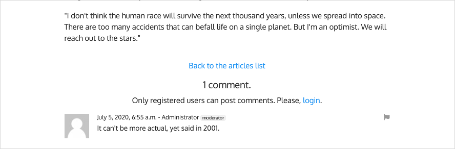

.. _ref-recipe-only-signed-in-can-comment:

================================
Only signed in users can comment
================================

This page describes how to setup django-comments-xtd so that only registered
users can write comments or flag them. That means mere visitors will be
able to see the comments but won't be able to send them. In order to do so a
visitor must login first. The following instructions use the Django
admin interface to login and logout users.

.. contents:: Table of Contents
   :depth: 1
   :local:

Simple example using only the backend
=====================================

A simple site using django-comments-xtd can be represented by the
:ref:`example-simple`.

Customize the simple project
----------------------------

The Simple project is a basic example site that allows both, visitors and
registered users, post comments to articles. It has been introduced in the Demo
projects page: :ref:`example-simple`. The example loads a couple of articles to
illustrate the functionality.

If you have already setup the :ref:`example-simple`, and have sent a few
testing comments to see that visitors and registered users can comment, add the
:setting:`COMMENTS_XTD_APP_MODEL_OPTIONS` entry at the bottom of the
``settings.py`` module to allow only registered users to post comments:

   .. code-block:: python

       COMMENTS_XTD_APP_MODEL_OPTIONS = {
           'default': {
               'allow_flagging': False,
               'allow_feedback': False,
               'show_feedback': False,
               'who_can_post': 'users'
           }
       }

Once the change is saved and Django has reloaded check that, as before,
registered users can comment without issues, however visitors get the HTTP-400
page (Bad Request).

As a final step to customize the simple example site either edit
``templates/comments/form.html`` or ``templates/articles/article_detail.html``
to display a message inviting visitors to login or register instead of showing
the post comment form.

As an example, here is a modified version of the ``article_detail.html``
template of the Simple project that displays a message with a link to the login
page when the user is not authenticated:

   .. code-block:: html+django

    [...]

      
        
          

            <h5 class="text-center">Post your comment</h5>
            

              
            

          

        
          

            Only registered users can post comments. Please,
            <a href="?next={{ object.get_absolute_url }}">login</a>.
          

        
      
        <h5 class="text-center">comments are disabled for this article</h5>
      

    [...]

Full featured example using backend and frontend code
=====================================================

This section goes through the steps to customize a project that uses both,
the backend and the frontend side of django-comments-xtd, to prevent that
unregistered users can post comments.

We will use the :ref:`example-comp`.

The :ref:`example-comp` contains two very similar apps: articles and quotes.
Both apps allow visitors and registered users to post nested comments. The main
difference between articles and quotes in the Comp project is that the articles
app uses the JavaScript plugin, while the quotes app uses merely the backend.

Customize the quotes app
------------------------

If you have already setup the :ref:`example-comp`, and have sent a few
testing comments to see that visitors and registered users can comment, edit
the :setting:`COMMENTS_XTD_APP_MODEL_OPTIONS` at the bottom of the
``settings.py`` and append the pair ``'who_can_post': 'users'`` to the
quotes app dictionary:

   .. code-block:: python

       COMMENTS_XTD_APP_MODEL_OPTIONS = {
           'quotes.quote': {
               'allow_flagging': True,
               'allow_feedback': True,
               'show_feedback': True,
               'who_can_post': 'users'
           }
       }

Once changes are saved and Django has restarted see that registered users can
comment without issues. However visitors get the HTTP-400 page (Bad Request).

One last customization is required to prevent the HTTP-400 Bad Request. We
have to edit the ``templates/quotes/quote_detail.html`` file and be sure
that the block that renders the comment form is not displayed when the user
browsing the site is a mere visitor. The following changes will make it:

   .. code-block:: html+django

    [...] around line 41...

        
          
            

              

                <h4 class="card-title text-center pb-3">Post your comment</h4>
                
              

            

          
            

              Only registered users can post comments. Please,
              <a href="?next={{ object.get_absolute_url }}">login</a>.
            

          
        
          <h4 class="mt-4 mb-5 text-center text-secondary">
            Comments are disabled for this quote.
          </h4>
        

    [...]

.. note::

    See that in the previous snippet we use the template filter
    :ttag:`can_receive_comments_from`. Using this filter you could change the
    setting ``'who_can_post'`` to ``'all'`` in your
    :setting:`COMMENTS_XTD_APP_MODEL_OPTIONS` to allow mere visitors to post
    comments, and your template would do as expected without further changes.

    If we rather had used ```` the template would
    have still to be changed to display the comment form to all, visitors and
    registered users.

After the template changes are saved, mere users will see a message
inviting them to login. Also, the **Reply** link to send nested comments is
already aware of the value of the ``'who_can_post'`` setting and will redirect
you to login if you have not done so yet.

Customize the articles app of the comp project
----------------------------------------------

The articles app uses the JavaScript plugin. The only change required consist of
adding the pair ``'who_can_post': 'users'`` to the ``'articles.article'``
dictionary entry of the :setting:`COMMENTS_XTD_APP_MODEL_OPTIONS`, as we did
with the quotes app. That will make it work.

Run the site and check that as a mere visitor (`logout
<http://localhost:8000/admin/logout>`_ first) you can not send comments to
articles. Instead of the comment form there must be a message in blue saying
that **Only registered users can post comments.** If you `login
<http://localhost:8000/admin/login/>`_ and visit an article's page the comment
form will be visible again.

The message in blue is the default response hardcoded in the ``commentbox.jsx``
module of the JavaScript plugin. The commentbox module controls whether the user
in the session can post comments or not. If the user can not post comments it
defaults to display that message in blue.

Most of the times we will want to customize that message. We will achieve it by
modifying both, the ``base.html`` and the ``articles/article_detail.html``, and
by creating a new template in the ``comp/templates/django_comments_xtd``
directory called ``only_users_can_post.html``.

The changes in ``templates/base.html`` consist of adding a hidden block. We will
put content in this hidden block in the ``articles_detail.html``. Add the
following HTML code before the script tags in the ``base.html`` in the
``example/comp/templates`` directory:

   .. code-block:: html+django

    [...] around line 67, right before the first <script> tag...

        

          
          
        

    [...]

Add the following code to ``templates/articles/article_detail.html``:

   .. code-block:: html+django

    [...] around line 46, right before the ...

    
      
    

And finally create the file ``only_users_can_post.html`` within the
``comp/templates/django_comments_xtd`` directory, with the following content
in it:

   .. code-block:: html+django

    

      
Only registered users can post comments. Please,
        <a href="?next={{ object.get_absolute_url }}">login</a>.
      

    

With all the changes already done,
`logout <http://localhost:8000/admin/logout/>`_ of the comp site and reload
the article's page. You should see the message with the login link.

